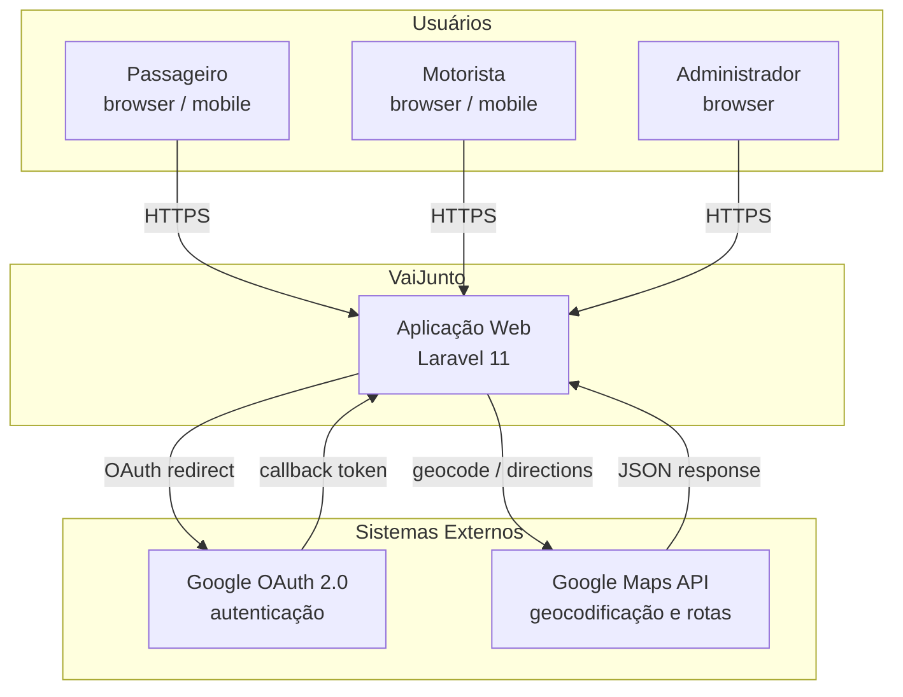
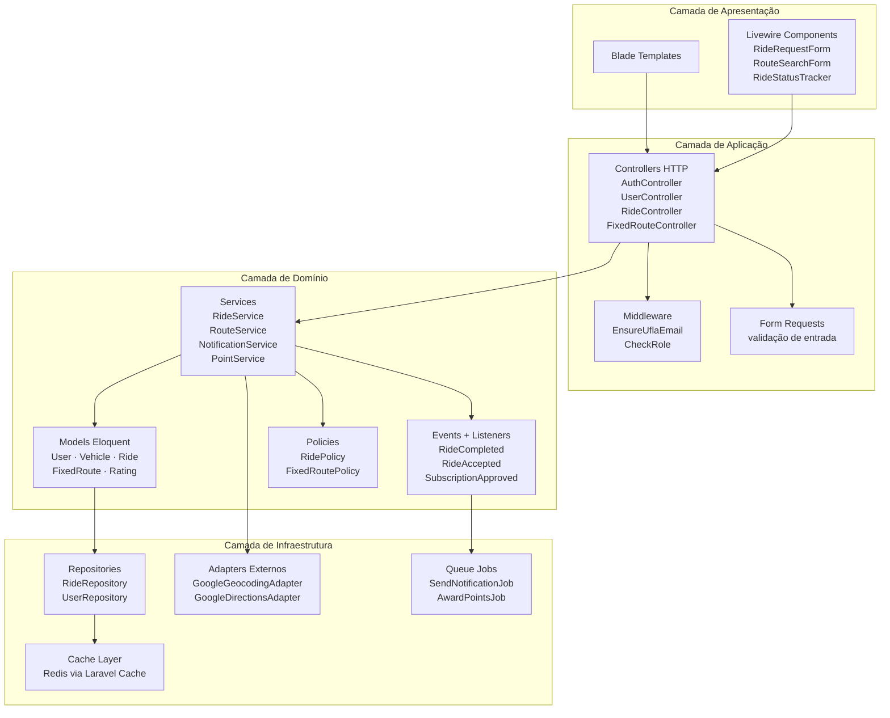
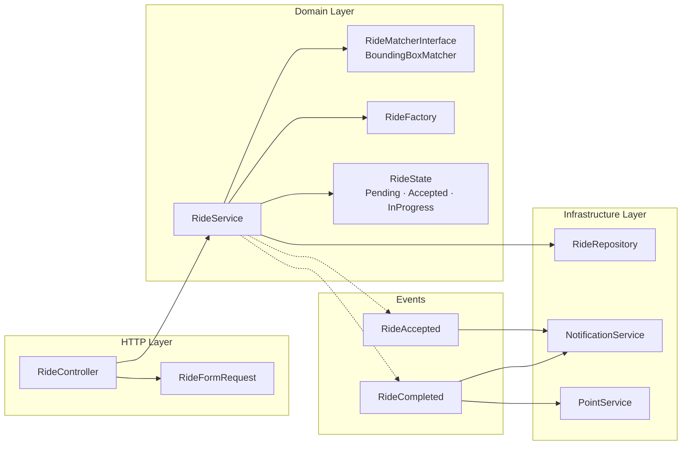
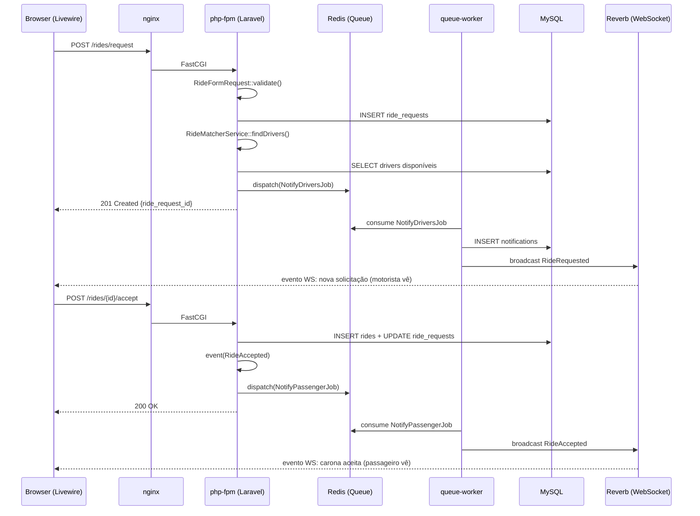
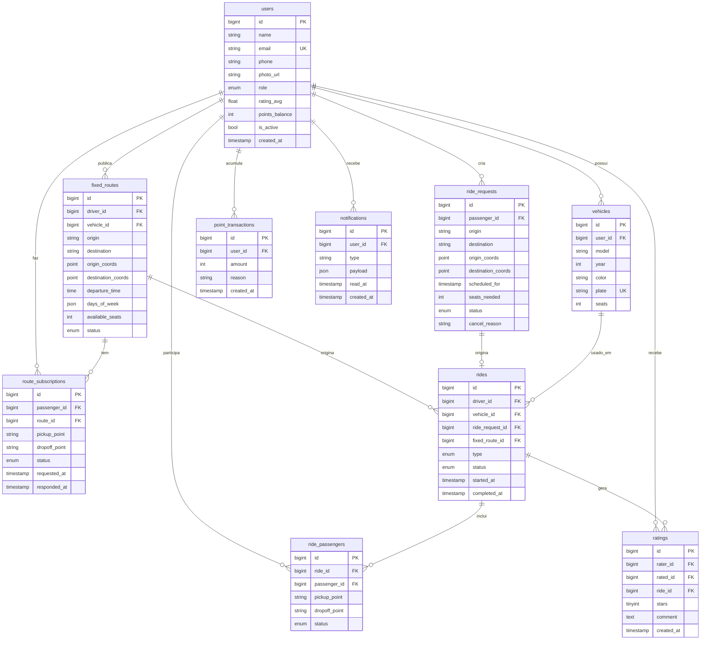

# Arquitetura de Software — VaiJunto

> Atualizado em: Sprint 6 (16/05/2026)

---

## 1. Visão Geral

O VaiJunto adota uma **arquitetura em camadas** (Layered Architecture) combinada com **orientação a eventos** (Event-Driven) para comunicação assíncrona entre módulos. A aplicação segue o padrão **MVC** do Laravel, estendido com uma camada de serviços (Service Layer) para isolar a lógica de negócio dos controllers.

### Estilo Arquitetural

| Estilo | Aplicação no VaiJunto |
|---|---|
| Layered (4 camadas) | Apresentação → Aplicação → Domínio → Infraestrutura |
| MVC | Laravel: Controllers, Blade/Livewire Views, Eloquent Models |
| Event-Driven | Eventos Laravel para comunicação desacoplada entre módulos |
| Client-Server | Browser ↔ Laravel App via HTTP/WebSocket |

---

## 2. Diagrama de Contexto (C4 — Nível 1)



---

## 3. Diagrama de Contêineres (C4 — Nível 2)

```mermaid
graph TB
    subgraph Docker Compose — VaiJunto
        NGINX[nginx\nReverse Proxy\n:80 / :443]
        PHP[php-fpm\nLaravel 11\nApp Server]
        REVERB[laravel-reverb\nWebSocket Server\n:8080]
        MYSQL[mysql:8.0\nBanco de Dados\n:3306]
        REDIS[redis:7\nCache · Queue · Sessions\n:6379]
        WORKER[queue-worker\nLaravel Queue\n—]
    end

    Browser -- HTTP/HTTPS --> NGINX
    Browser -- WS/WSS --> REVERB
    NGINX -- FastCGI --> PHP
    PHP -- TCP --> MYSQL
    PHP -- TCP --> REDIS
    PHP -- publish events --> REVERB
    WORKER -- consume jobs --> REDIS
    WORKER -- TCP --> MYSQL
```

### Responsabilidades dos Contêineres

| Contêiner | Imagem | Responsabilidade |
|---|---|---|
| `nginx` | `nginx:alpine` | Reverse proxy, SSL termination, arquivos estáticos |
| `php-fpm` | `php:8.3-fpm` + Laravel | Lógica de aplicação, controllers, services, models |
| `laravel-reverb` | `php:8.3-cli` | Servidor WebSocket para notificações em tempo real |
| `mysql` | `mysql:8.0` | Persistência relacional de todos os dados do domínio |
| `redis` | `redis:7-alpine` | Cache de consultas, filas de jobs, armazenamento de sessões |
| `queue-worker` | `php:8.3-cli` | Processa jobs assíncronos (notificações email, pontos) |

---

## 4. Diagrama de Camadas (Layered Architecture)



---

## 5. Diagrama de Componentes — Módulo Ride (C4 — Nível 3)



---

## 6. Fluxo de Dados — Carona sob Demanda (end-to-end)



---

## 7. Esquema do Banco de Dados



---

## 8. Justificativa das Escolhas Arquiteturais

### 8.1 Layered Architecture

**Motivo:** separa claramente apresentação, lógica de negócio e infraestrutura. Mudanças em uma camada não afetam as demais. Diretamente alinhado com SRP e DIP da Sprint 4.

**Alternativa rejeitada:** arquitetura monolítica sem camadas (fat controllers) — inviabiliza testes e manutenção.

### 8.2 Event-Driven para comunicação entre módulos

**Motivo:** módulos como Gamificação e Notificações não devem ser chamados diretamente pelo módulo de Ride. Eventos garantem desacoplamento e extensibilidade (OCP). Jobs na fila garantem que falhas em notificações não interrompem o fluxo principal.

**Alternativa rejeitada:** chamadas diretas entre services — gera acoplamento e dificulta testes.

### 8.3 Redis para filas, cache e sessões

**Motivo:** driver único para três necessidades (filas assíncronas, cache de consultas frequentes, sessões). Evita sobrecarga no MySQL com queries repetidas (ex: perfil do usuário, lista de rotas ativas).

**Alternativa rejeitada:** MySQL para filas — baixo desempenho em alta concorrência; arquivos para cache — não funciona em múltiplas instâncias.

### 8.4 nginx como reverse proxy

**Motivo:** separar o servidor HTTP (nginx) do servidor de aplicação (php-fpm) é prática padrão de produção. nginx serve arquivos estáticos sem passar pelo PHP e faz SSL termination.

### 8.5 Livewire para reatividade no frontend

**Motivo:** eliminando a necessidade de construir uma API REST separada, Livewire mantém o código PHP/Blade como única fonte de verdade. Reduz a superfície de ataque e o esforço de desenvolvimento.

---

## 9. Atributos de Qualidade

| Atributo | Estratégia arquitetural |
|---|---|
| **Segurança** | Middleware `EnsureUflaEmail` valida domínio em toda requisição autenticada; Policies do Laravel controlam autorização por recurso |
| **Desempenho** | Redis para cache de rotas e sessões; jobs assíncronos para operações lentas (notificações) |
| **Escalabilidade** | Múltiplos workers de fila independentes; nginx com upstream balanceado para múltiplas instâncias php-fpm |
| **Manutenibilidade** | Service Layer + padrões GoF (Sprint 5) garantem baixo acoplamento; cobertura de testes por camada |
| **Disponibilidade** | Docker Compose com restart policies; Redis como buffer para operações não críticas |
| **Portabilidade** | Docker garante paridade entre desenvolvimento, CI e produção |
