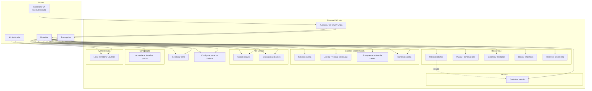
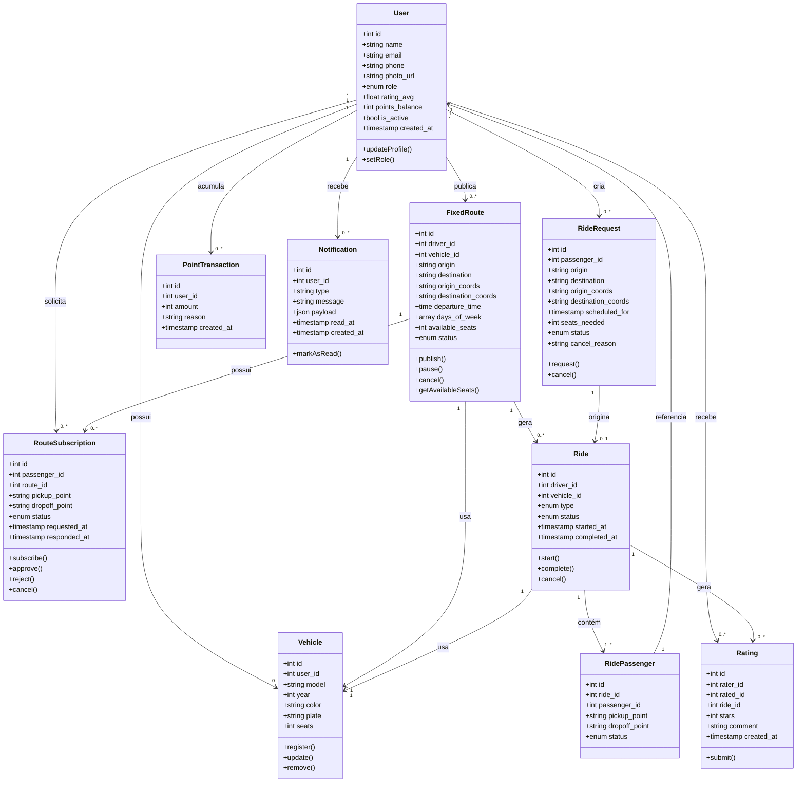
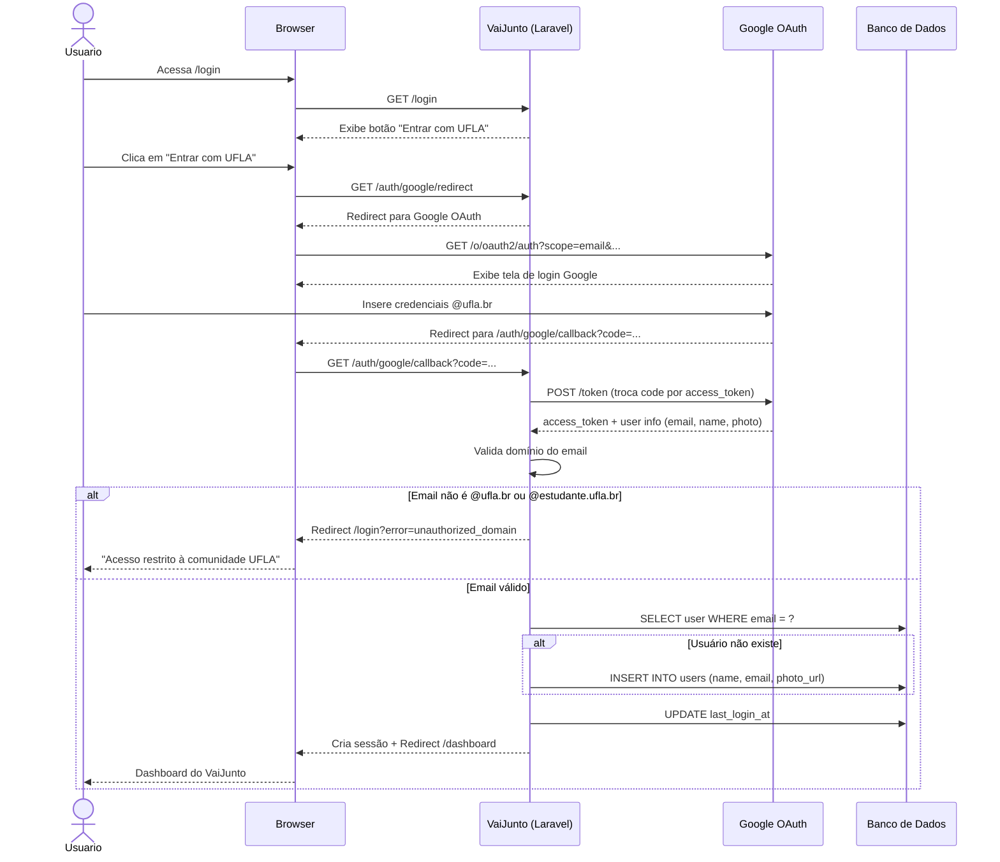
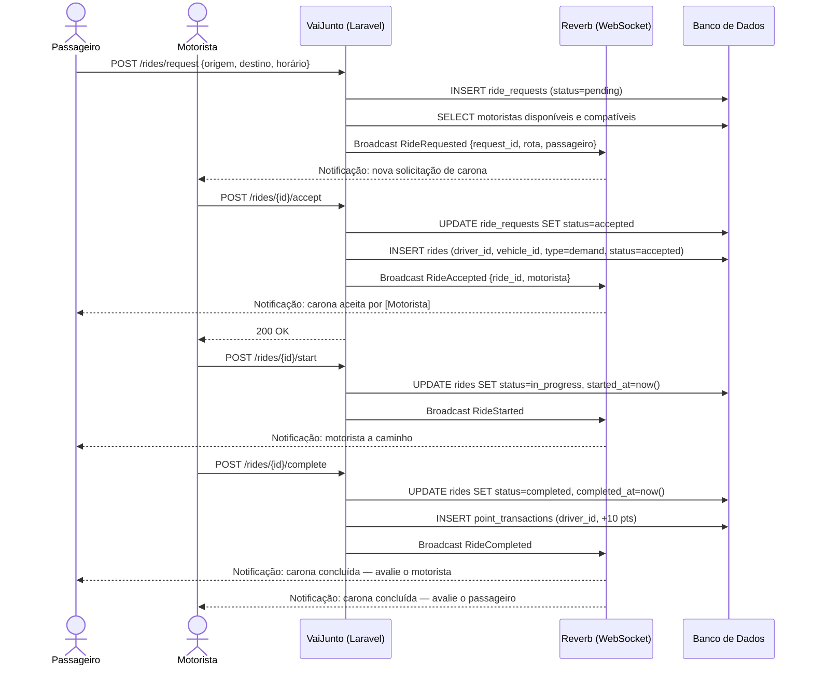
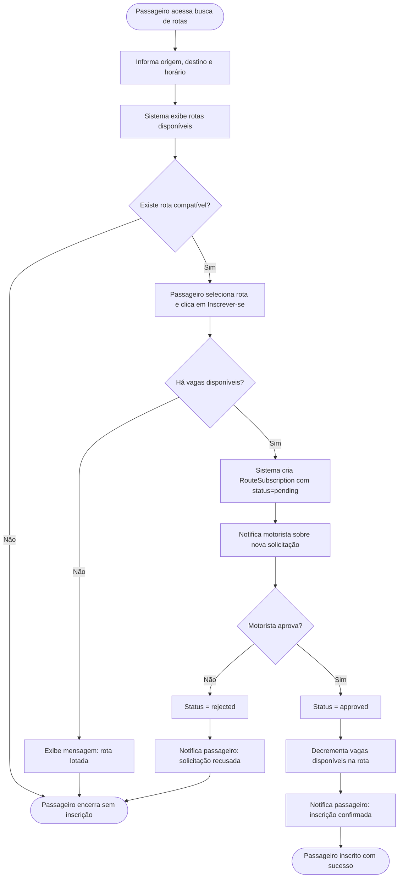

# Modelagem do Sistema — VaiJunto

> Atualizado em: Sprint 3 (25/04/2026)

---

## 1. Diagrama de Casos de Uso

---

## 2. Diagrama de Classes

---

## 3. Diagrama de Sequência — Autenticação via OAuth UFLA

---

## 4. Diagrama de Sequência — Solicitação de Carona sob Demanda

---

## 5. Diagrama de Atividades — Inscrição em Rota Fixa

---

## 6. Vínculo entre Requisitos e Modelos

| Requisito | Modelo(s) relacionado(s) |
|---|---|
| RF-01 (Autenticação OAuth) | Diagrama de Sequência 3, Casos de Uso UC01 |
| RF-02 (Perfil) | Classe `User`, UC02 |
| RF-03 (Papel) | Atributo `role` em `User`, UC03 |
| RF-04 (Veículo) | Classe `Vehicle`, UC13 |
| RF-05 (Publicar rota fixa) | Classe `FixedRoute`, UC04 |
| RF-06 (Buscar rotas) | UC07 |
| RF-07 (Inscrever-se em rota) | Classe `RouteSubscription`, UC08, Diagrama de Atividades 5 |
| RF-08 (Aprovar/recusar inscrição) | `RouteSubscription.approve()`, UC06, Diagrama de Atividades 5 |
| RF-09 (Pausar/cancelar rota) | `FixedRoute.pause()`, `FixedRoute.cancel()`, UC05 |
| RF-10 (Solicitar carona sob demanda) | Classe `RideRequest`, UC09, Diagrama de Sequência 4 |
| RF-11 (Notificar motoristas) | Classe `Notification`, WebSocket no Diagrama de Sequência 4 |
| RF-12 (Aceitar/recusar solicitação) | `Ride`, UC10, Diagrama de Sequência 4 |
| RF-13 (Status da carona) | Atributo `status` em `Ride` e `RideRequest`, UC11 |
| RF-14 (Cancelar carona) | `Ride.cancel()`, UC12 |
| RF-15, RF-16 (Avaliações) | Classe `Rating`, UC14 |
| RF-17 (Exibir avaliação média) | `User.rating_avg`, UC15 |
| RF-18, RF-19 (Notificações) | Classe `Notification`, WebSocket nos diagramas de sequência |
| RF-20, RF-21 (Gamificação) | Classe `PointTransaction`, UC16 |
| RF-23, RF-24 (Mapas) | Atributos `*_coords` em `FixedRoute` e `RideRequest` |
| RF-25, RF-26 (Administração) | UC17 |
