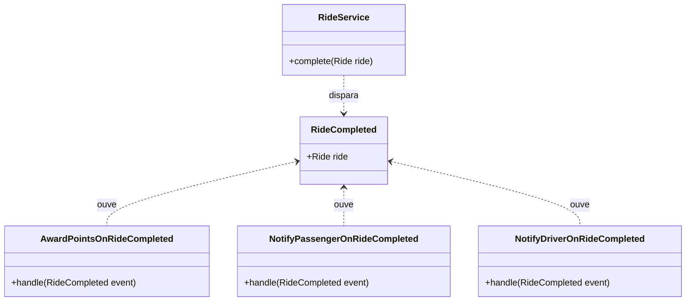
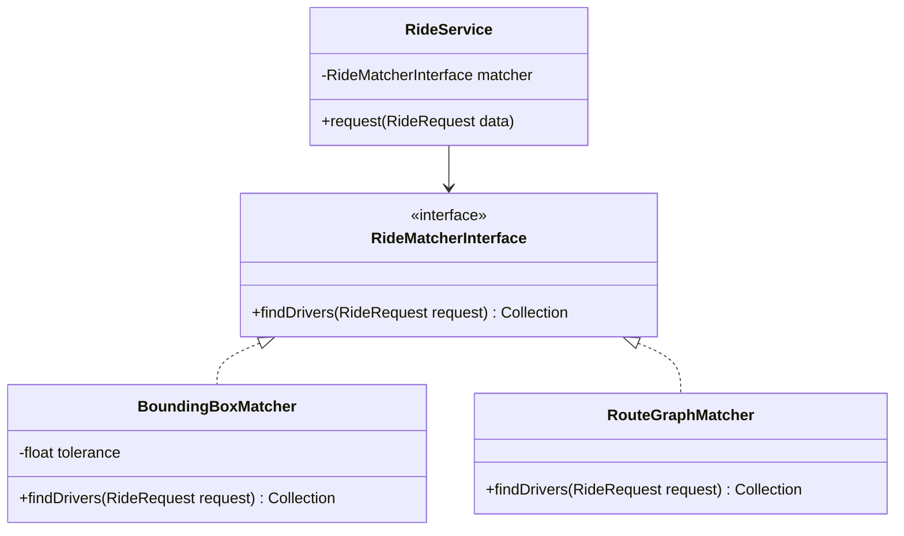
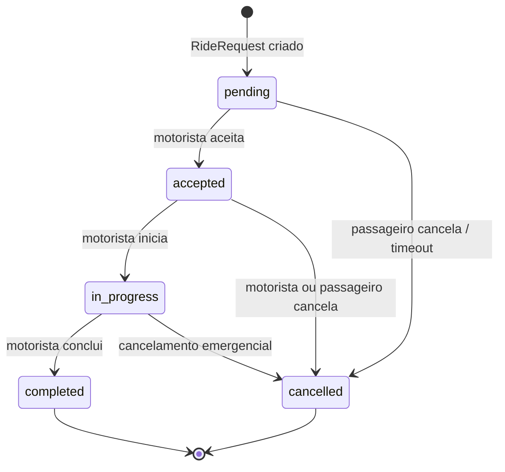
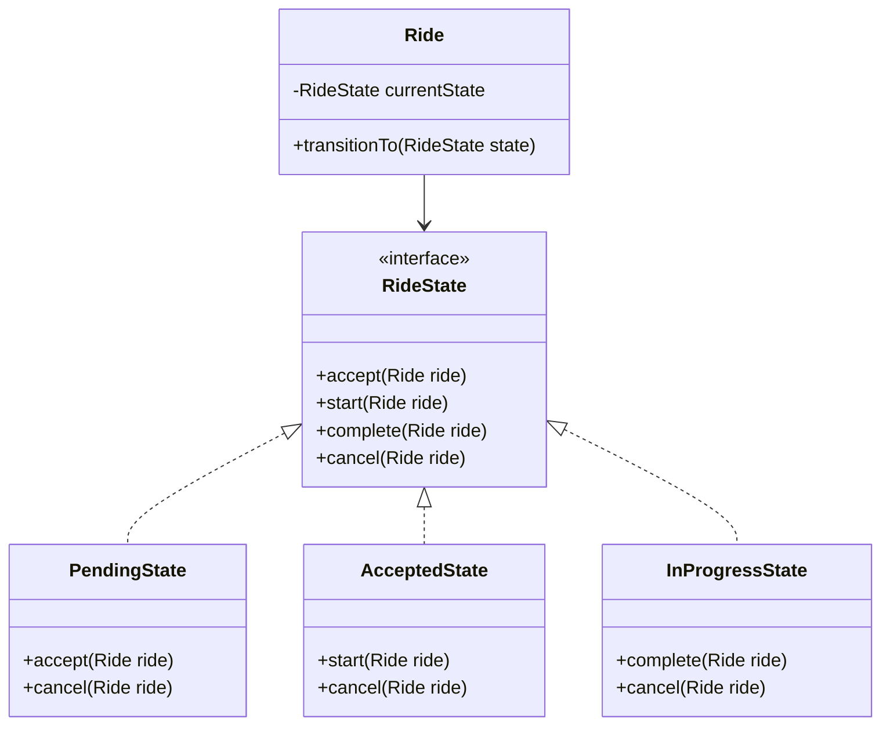
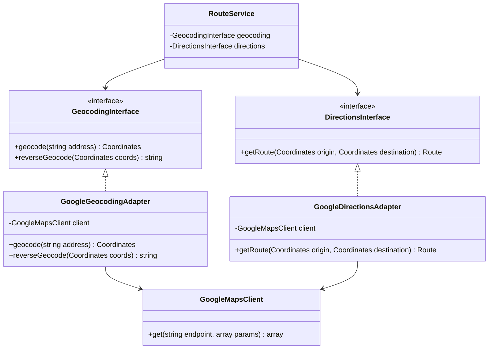
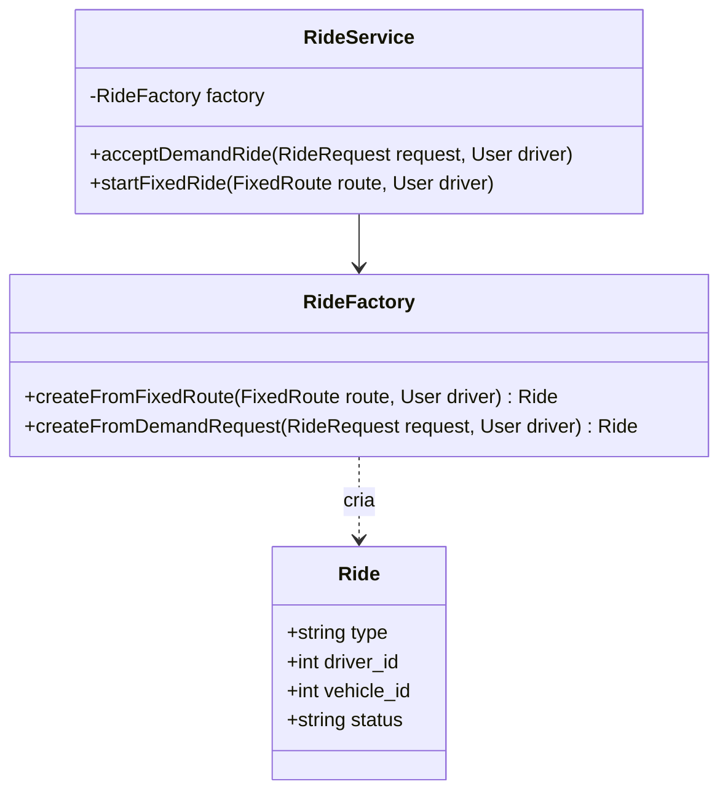
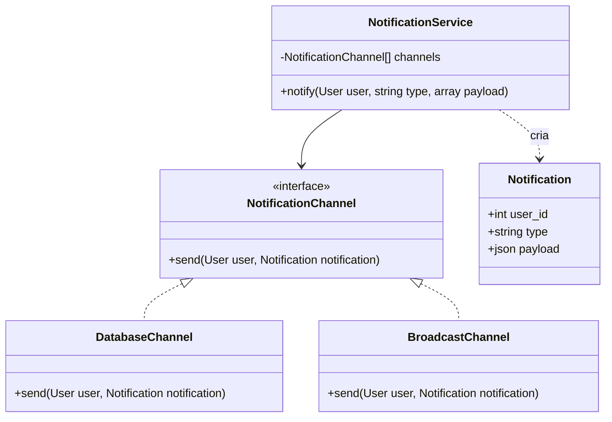
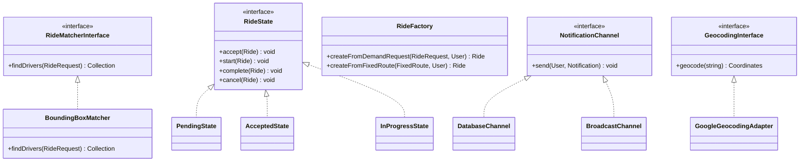

# Padrões de Projeto — VaiJunto

> Atualizado em: Sprint 5 (09/05/2026)

---

## Visão Geral

A partir da estrutura de módulos e decisões definidas na Sprint 4, foram identificadas 6 oportunidades de aplicação de padrões GoF. Cada padrão resolve um problema recorrente específico da solução, com justificativa técnica e representação de como se encaixa no código.

| Padrão | Categoria | Problema resolvido |
|---|---|---|
| Observer | Comportamental | Desacoplar reações ao término de uma carona |
| Strategy | Comportamental | Algoritmo de matching substituível sem impacto no serviço |
| State | Comportamental | Ciclo de vida da carona com transições controladas |
| Adapter | Estrutural | Isolar a dependência da API do Google Maps |
| Factory Method | Criacional | Criar o tipo correto de carona sem `if` no controller |
| Facade | Estrutural | Simplificar o envio de notificações multi-canal |

---

## 1. Observer

### Problema

Quando uma carona é concluída (`RideCompleted`), três ações devem ocorrer: creditar pontos ao motorista, notificar o passageiro para avaliar e notificar o motorista para avaliar o passageiro. Colocar tudo isso em `RideService::complete()` viola o SRP e cria acoplamento direto com Gamificação e Notificações.

### Solução

O evento `RideCompleted` é disparado por `RideService`. Listeners independentes reagem ao evento sem que o serviço saiba de sua existência.



### Implementação no Laravel

```php
// app/Services/RideService.php
public function complete(Ride $ride): void
{
    $ride->update(['status' => 'completed', 'completed_at' => now()]);
    event(new RideCompleted($ride)); // Observer: listeners reagem sem acoplamento
}

// app/Listeners/AwardPointsOnRideCompleted.php
public function handle(RideCompleted $event): void
{
    $this->pointService->award($event->ride->driver_id, 10, 'carona concluída');
}
```

### Justificativa

- **SRP:** `RideService` tem uma responsabilidade; pontos e notificações são responsabilidades dos listeners
- **OCP:** novos comportamentos pós-carona (ex: email de resumo) são adicionados como novos listeners, sem modificar `RideService`
- **Benefício:** toda ação pós-carona é rastreável individualmente e testável de forma isolada

---

## 2. Strategy

### Problema

O algoritmo de matching entre passageiros e motoristas pode evoluir (ex: de bounding box para grafos de rotas). Se `RideService` depender diretamente de `RideMatcherService`, qualquer mudança de algoritmo exige alteração no serviço principal.

### Solução

`RideMatcherInterface` define o contrato. `BoundingBoxMatcher` é a implementação do MVP. O serviço depende da interface (DIP) e recebe a estratégia via injeção de dependência.



### Implementação no Laravel

```php
// app/Contracts/RideMatcherInterface.php
interface RideMatcherInterface {
    public function findDrivers(RideRequest $request): Collection;
}

// app/Services/BoundingBoxMatcher.php
class BoundingBoxMatcher implements RideMatcherInterface {
    private float $tolerance = 0.05; // ~5km em graus decimais

    public function findDrivers(RideRequest $request): Collection {
        return User::drivers()
            ->withinBounds($request->origin_coords, $this->tolerance)
            ->availableAt($request->scheduled_for)
            ->get();
    }
}

// app/Providers/AppServiceProvider.php
$this->app->bind(RideMatcherInterface::class, BoundingBoxMatcher::class);
```

### Justificativa

- **OCP + DIP:** trocar o algoritmo é apenas trocar o binding no `AppServiceProvider`
- **Testabilidade:** `RideService` pode ser testado com um matcher mock sem acesso ao banco
- **Benefício:** o MVP usa `BoundingBoxMatcher`; versões futuras podem usar `RouteGraphMatcher` sem reescrever nada

---

## 3. State

### Problema

Uma carona possui 5 estados (`pending`, `accepted`, `in_progress`, `completed`, `cancelled`) com transições restritas. Sem controle explícito, qualquer parte do código pode tentar mudar o estado de forma inválida (ex: completar uma carona pendente).

### Solução

O padrão State encapsula as transições válidas. A classe `Ride` delega a lógica de mudança de estado para a classe de estado correspondente.





### Implementação no Laravel

```php
// app/States/PendingState.php
class PendingState implements RideState {
    public function accept(Ride $ride): void {
        $ride->transitionTo(new AcceptedState());
        event(new RideAccepted($ride));
    }
    public function start(Ride $ride): void {
        throw new InvalidStateTransitionException('Carona pendente não pode ser iniciada.');
    }
}
```

### Justificativa

- **SRP:** cada estado é responsável pelas transições que lhe cabem
- **Segurança de dados:** transições inválidas lançam exceção — nunca acontecem silenciosamente
- **Benefício:** o código de negócio fica legível (`$ride->accept()`) sem `if/switch` espalhados

---

## 4. Adapter

### Problema

O sistema depende do Google Maps API para geocodificação e cálculo de rotas. Essa dependência externa possui uma interface própria que não deve vazar para o domínio da aplicação. Se a API mudar (ou for substituída), nenhum código de domínio deve ser alterado.

### Solução

`GeocodingService` e `DirectionsService` são Adapters que traduzem a interface do Google Maps para os tipos internos do VaiJunto.



### Justificativa

- **DIP:** `RouteService` depende das interfaces, não do Google Maps diretamente
- **OCP:** substituir Google Maps por OpenStreetMap/Nominatim requer apenas um novo Adapter
- **Testabilidade:** testes unitários usam um `FakeGeocodingAdapter` sem chamadas HTTP
- **Benefício:** o custo de API (Google Maps tem limite free tier) pode ser mitigado trocando o adapter por uma alternativa gratuita sem alterar o domínio

---

## 5. Factory Method

### Problema

Caronas podem ser de dois tipos: `fixed` (originada de rota fixa) e `demand` (solicitação direta). A lógica de criação difere: uma carona fixa referencia uma `FixedRoute`, enquanto uma sob demanda referencia uma `RideRequest`. Colocar essa lógica no controller resulta em `if/else` de criação.

### Solução

`RideFactory` centraliza a lógica de criação e retorna o objeto correto de acordo com o tipo.



### Implementação no Laravel

```php
// app/Factories/RideFactory.php
class RideFactory {
    public function createFromDemandRequest(RideRequest $request, User $driver): Ride {
        return Ride::create([
            'driver_id'    => $driver->id,
            'vehicle_id'   => $driver->vehicle->id,
            'type'         => 'demand',
            'status'       => 'accepted',
            'ride_request_id' => $request->id,
        ]);
    }

    public function createFromFixedRoute(FixedRoute $route, User $driver): Ride {
        return Ride::create([
            'driver_id'      => $driver->id,
            'vehicle_id'     => $route->vehicle_id,
            'type'           => 'fixed',
            'status'         => 'accepted',
            'fixed_route_id' => $route->id,
        ]);
    }
}
```

### Justificativa

- **SRP:** a responsabilidade de "como criar uma Ride" pertence à factory, não ao controller nem ao service
- **Legibilidade:** o código do service expressa intenção (`$this->factory->createFromDemandRequest(...)`) sem detalhes de construção
- **Benefício:** novos tipos de carona no futuro (ex: carona compartilhada multi-trecho) adicionam apenas um novo método na factory

---

## 6. Facade

### Problema

Enviar uma notificação envolve múltiplas etapas: persistir no banco (`notifications` table), transmitir via WebSocket (Reverb) e, futuramente, enviar email. O código chamador não deve precisar conhecer todos esses passos.

### Solução

`NotificationService` atua como Facade, escondendo a complexidade dos canais de entrega.



### Implementação no Laravel

```php
// app/Services/NotificationService.php
class NotificationService {
    public function __construct(
        private array $channels // injetados via AppServiceProvider
    ) {}

    public function notify(User $user, string $type, array $payload): void {
        $notification = Notification::create([
            'user_id' => $user->id,
            'type'    => $type,
            'payload' => $payload,
        ]);

        foreach ($this->channels as $channel) {
            $channel->send($user, $notification); // OCP: novos canais sem modificar este método
        }
    }
}

// Chamada no Listener (simples, sem conhecer os canais):
$this->notificationService->notify($ride->passenger, 'ride_accepted', ['ride_id' => $ride->id]);
```

### Justificativa

- **OCP:** novo canal de notificação (email, push) implementa `NotificationChannel` e é injetado, sem modificar `NotificationService`
- **Facade:** o chamador usa uma interface simples (`notify($user, $type, $payload)`) sem conhecer os canais internos
- **Benefício:** cada Listener usa apenas uma linha para notificar, independentemente de quantos canais existam

---

## 7. Atualização do Diagrama de Classes

Os padrões introduzem as seguintes adições ao diagrama de classes da Sprint 3:


