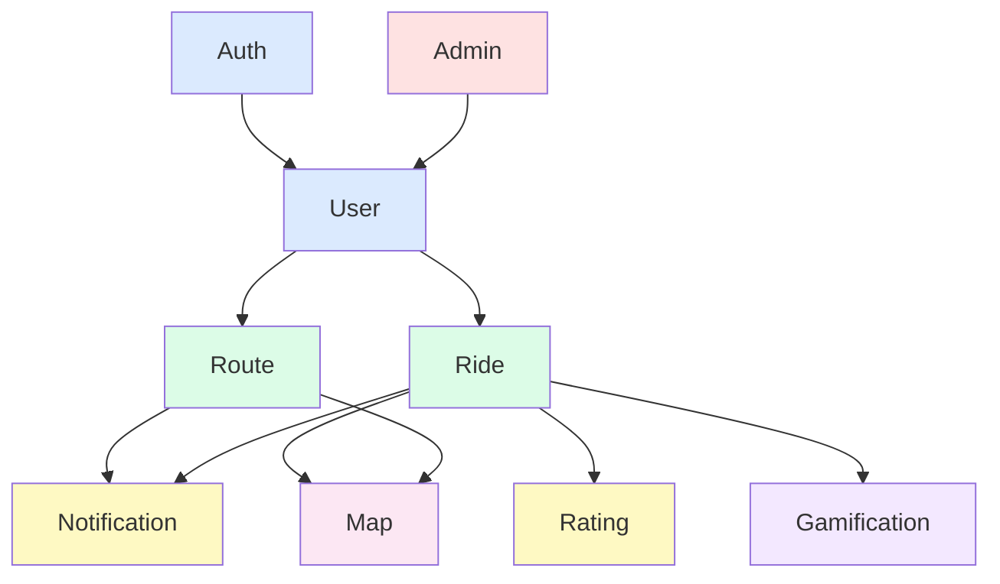

# Decisões de Projeto — VaiJunto

> Atualizado em: Sprint 4 (02/05/2026)

---

## 1. Decomposição em Módulos

A solução foi decomposta em 9 módulos com responsabilidades bem delimitadas, cada um mapeando diretamente para um namespace Laravel (`app/Modules/` ou `app/Services/`):

| Módulo | Responsabilidade | Classes Principais |
|---|---|---|
| **Auth** | Autenticação OAuth e gerenciamento de sessão | `OAuthController`, `AuthService` |
| **User** | Perfil, papéis e veículos do usuário | `UserController`, `UserService`, `VehicleService` |
| **Route** | Rotas fixas recorrentes e inscrições | `FixedRouteController`, `RouteService`, `SubscriptionService` |
| **Ride** | Caronas sob demanda e ciclo de vida | `RideController`, `RideService`, `RideMatcherService` |
| **Notification** | Notificações em tempo real via WebSocket | `NotificationService`, eventos Reverb |
| **Rating** | Avaliações pós-carona | `RatingController`, `RatingService` |
| **Gamification** | Pontos e ranking de motoristas | `PointService` |
| **Map** | Integração com Google Maps | `GeocodingService`, `DirectionsService` |
| **Admin** | Moderação de usuários | `AdminController` |

---

## 2. Princípios de Projeto Aplicados

### 2.1 Single Responsibility Principle (SRP)

Cada classe possui uma única razão para mudar.

**Aplicação:**
- `User` armazena dados de identidade — autenticação é responsabilidade de `AuthService`
- `RideService` orquestra o ciclo de vida da carona — notificações são delegadas a `NotificationService`
- `RideMatcherService` contém exclusivamente o algoritmo de matching entre passageiros e motoristas disponíveis

**Violação evitada:** controllers gordos que acumulam lógica de negócio, persistência e envio de notificações.

---

### 2.2 Open/Closed Principle (OCP)

O sistema deve ser aberto para extensão e fechado para modificação.

**Aplicação:**
- `NotificationChannel` é uma interface; novos canais (email, push, SMS) são adicionados implementando a interface, sem alterar o código existente
- O sistema de pontos é extensível: novos eventos que geram pontos são registrados no `EventServiceProvider` sem modificar `PointService`

```
interface NotificationChannel {
    send(User $user, Notification $notification): void
}

class DatabaseNotificationChannel implements NotificationChannel { ... }
class BroadcastNotificationChannel implements NotificationChannel { ... }
// Futuro: class EmailNotificationChannel implements NotificationChannel { ... }
```

---

### 2.3 Liskov Substitution Principle (LSP)

Subtipos devem poder substituir seus tipos base sem quebrar o comportamento.

**Aplicação:**
- `FixedRide` e `DemandRide` estendem `Ride` e são intercambiáveis onde o tipo base for esperado
- Qualquer serviço que opere sobre `Ride` funciona independentemente do subtipo concreto

---

### 2.4 Interface Segregation Principle (ISP)

Clientes não devem depender de interfaces que não utilizam.

**Aplicação:**
- `PassengerActions` e `DriverActions` são interfaces separadas — um usuário que só é passageiro não implementa `publishRoute()` ou `acceptRide()`
- `RideRepository` e `RouteRepository` são interfaces distintas, cada uma com apenas os métodos necessários para seu domínio

---

### 2.5 Dependency Inversion Principle (DIP)

Módulos de alto nível não devem depender de módulos de baixo nível; ambos devem depender de abstrações.

**Aplicação:**
- `RideService` depende de `RideMatcherInterface`, não de `RideMatcherService` diretamente — facilita troca de algoritmo sem alterar o serviço
- `NotificationService` depende de `NotificationChannel[]` — injeção de dependência via container do Laravel

---

### 2.6 Alta Coesão e Baixo Acoplamento

- Cada módulo possui alta coesão: os elementos internos trabalham para o mesmo objetivo
- O acoplamento entre módulos é feito via eventos Laravel (`RideCompleted`, `RideAccepted`, `SubscriptionApproved`) — os módulos não se chamam diretamente, comunicam-se por eventos
- O módulo de Gamificação ouve o evento `RideCompleted` e credita pontos sem que `RideService` precise conhecer `PointService`

---

## 3. Decisões de Projeto

### Decisão 1 — Papéis de usuário: coluna enum vs. tabelas separadas

| Alternativa | Vantagens | Desvantagens |
|---|---|---|
| Coluna `role` enum em `users` | Simples, sem JOIN, perfil unificado | Validações condicionais na mesma model |
| Tabelas `passengers` e `drivers` separadas | Isolamento completo | Duplicação de dados, queries mais complexas |

**Decisão:** coluna `role` com valores `passenger`, `driver`, `both`.
**Justificativa:** um mesmo usuário pode ser passageiro em alguns trajetos e motorista em outros. Tabelas separadas causariam duplicação e dificultariam consultas unificadas. Laravel Policies lidam com autorização por papel sem acoplamento na Model.

---

### Decisão 2 — Algoritmo de matching: query geográfica vs. ML

| Alternativa | Vantagens | Desvantagens |
|---|---|---|
| Filtragem por bounding box + janela de tempo | Simples, sem dependência externa, rápido | Matching menos preciso em áreas densas |
| ML/recomendação | Alta precisão | Complexidade fora do escopo do MVP |

**Decisão:** `RideMatcherService` filtra motoristas com rota compatível usando bounding box nas coordenadas (±0.05° de latitude/longitude) e janela de tempo de ±30 minutos.
**Justificativa:** suficiente para o contexto de Lavras/MG. A interface `RideMatcherInterface` garante que o algoritmo pode ser substituído sem impacto no restante do sistema (OCP + DIP).

---

### Decisão 3 — Comunicação em tempo real: WebSocket vs. polling

| Alternativa | Vantagens | Desvantagens |
|---|---|---|
| Laravel Reverb (WebSocket) | Baixa latência, experiência fluída | Maior complexidade de infraestrutura |
| Polling periódico (AJAX) | Simples de implementar | Latência alta, desperdício de requisições |

**Decisão:** Laravel Reverb com Livewire para eventos em tempo real.
**Justificativa:** o contexto de carona sob demanda exige notificação imediata (motorista aceita → passageiro vê em segundos). Polling causaria UX degradada e carga desnecessária no servidor.

---

### Decisão 4 — Camada de serviço: Service Classes vs. Fat Controllers

| Alternativa | Vantagens | Desvantagens |
|---|---|---|
| Service Classes (`RideService`, `RouteService`) | SRP, testabilidade, reuso entre controllers e jobs | Mais arquivos |
| Lógica nos Controllers | Menos arquivos | Controllers difíceis de testar e manter |

**Decisão:** Service Classes para toda lógica de negócio.
**Justificativa:** controllers devem apenas receber a requisição, delegar ao serviço e retornar a resposta. Isso viabiliza testes unitários dos serviços sem depender do ciclo HTTP.

---

### Decisão 5 — Reatividade da UI: Livewire vs. SPA (Vue/React)

| Alternativa | Vantagens | Desvantagens |
|---|---|---|
| Livewire (server-side rendering reativo) | Integração nativa com Laravel, sem API REST extra | Latência de rede em cada interação |
| Vue.js / React (SPA) | UI mais fluída | Requer API REST separada, maior complexidade |

**Decisão:** Livewire com Blade.
**Justificativa:** elimina a necessidade de construir e manter uma API REST separada no MVP. O time possui mais familiaridade com PHP/Laravel do que com frameworks JavaScript modernos.

---

## 4. Diagrama de Módulos e Dependências



> As dependências seguem sempre de módulos de alto nível (Auth, User) para módulos de suporte (Notification, Map). Nenhuma dependência circular existe.

---

## 5. Estrutura de Pastas do Código-Fonte

```
src/
└── app/
    ├── Http/
    │   ├── Controllers/
    │   │   ├── AuthController.php
    │   │   ├── UserController.php
    │   │   ├── VehicleController.php
    │   │   ├── FixedRouteController.php
    │   │   ├── RideController.php
    │   │   ├── RatingController.php
    │   │   └── AdminController.php
    │   └── Livewire/
    │       ├── RideRequestForm.php
    │       ├── RouteSearchForm.php
    │       └── RideStatusTracker.php
    ├── Services/
    │   ├── AuthService.php
    │   ├── UserService.php
    │   ├── VehicleService.php
    │   ├── RouteService.php
    │   ├── SubscriptionService.php
    │   ├── RideService.php
    │   ├── RideMatcherService.php
    │   ├── NotificationService.php
    │   ├── RatingService.php
    │   ├── PointService.php
    │   ├── GeocodingService.php
    │   └── DirectionsService.php
    ├── Models/
    │   ├── User.php
    │   ├── Vehicle.php
    │   ├── FixedRoute.php
    │   ├── RouteSubscription.php
    │   ├── RideRequest.php
    │   ├── Ride.php
    │   ├── RidePassenger.php
    │   ├── Rating.php
    │   ├── PointTransaction.php
    │   └── Notification.php
    ├── Events/
    │   ├── RideAccepted.php
    │   ├── RideCompleted.php
    │   ├── RideCancelled.php
    │   └── SubscriptionApproved.php
    ├── Listeners/
    │   ├── AwardPointsOnRideCompleted.php
    │   ├── NotifyPassengerOnRideAccepted.php
    │   └── NotifyDriverOnSubscriptionRequest.php
    ├── Contracts/
    │   ├── RideMatcherInterface.php
    │   └── NotificationChannel.php
    └── Policies/
        ├── RidePolicy.php
        └── FixedRoutePolicy.php
```
